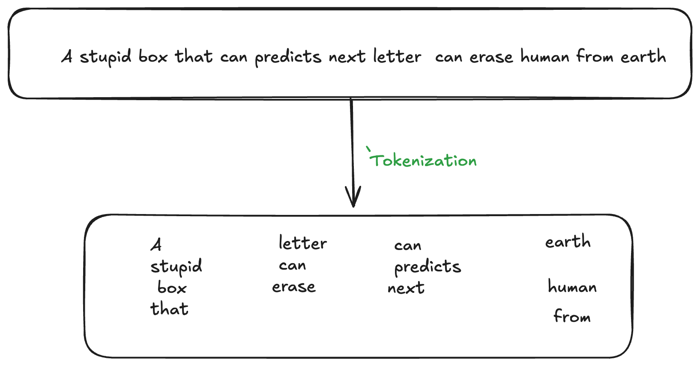

# Tokenization
Tokenization is the process of breaking down a piece of text into smaller units called tokens. These tokens are often words, punctuation marks, or even parts of words.





### demo link   https://tokenization-assignment.netlify.app/

## Installation

```bash
# Clone the repo
git clone https://github.com/gouravindoriya/tokenization.git

# Go into the project folder
cd tokonization

# Install dependencies
npm install

# Run the development server
npm run dev
```


```js
# customEncode
 function customEncode(text: string) {

    const tokens = text.match(regex) || [];
    const ids = tokens.map(token => {
      if (!(token in vocab)) {
        vocab[token] = idCounter++;
      }
      return vocab[token];
    });

    return { tokens, ids };
  }

```


## Tech Stack
- **Frontend:** React + Tailwind CSS + typescript
- **Tokenization:** custom implemention with regex
- **Deployment:** Netlify

## Features
- Displays token count and estimated cost for LLM APIs.
- Real-time tokenization preview as you type.
- Copy tokens to clipboard.
- Dark & Light mode UI.
